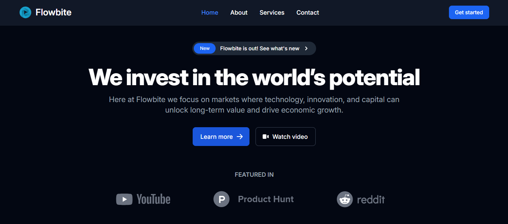

````markdown
# 🚀 React Landing Page

A responsive landing page built with **React** and styled using **Tailwind CSS** and **Flowbite**. Clean, modern, and fully responsive — perfect as a base for marketing pages, SaaS apps, or personal projects.



---

## ✨ Features

- ⚛️ Built with React + Vite
- 🎨 Tailwind CSS for rapid styling
- 📱 Fully responsive layout
- 🌙 Dark mode ready (optional to add)
- 🧩 Component-based structure

---

## 🛠️ Tech Stack

- [React](https://reactjs.org/)
- [Vite](https://vitejs.dev/)
- [Tailwind CSS](https://tailwindcss.com/)
- [Flowbite](https://flowbite.com/)

---

## 📦 Getting Started

Clone the project and install dependencies:

```bash
git clone https://github.com/obahchimaobi/react-landing-page.git
cd react-landing-page
npm install
````

Start the development server:

```bash
npm run dev
```

---

## 🚀 Deployment

You can deploy this app using platforms like **Vercel**, **Netlify**, or **GitHub Pages**.

---

## 📁 Folder Structure

```
src/
├── components/     # Reusable UI components
├── assets/         # Images and icons
├── App.jsx         # Main app component
├── main.jsx        # Entry point
├── index.css       # Tailwind directives
```

---

## 📸 Live Demo

[View it live](https://your-demo-link.com) <!-- Replace with actual demo link -->

---

## 📄 License

This project is open source and available under the [MIT License](LICENSE).

---

## 🙌 Acknowledgments

Inspired by modern UI designs and Tailwind landing page templates.

```

---

Let me know if you want to include your name, add badges, or auto-generate a screenshot thumbnail.
```
